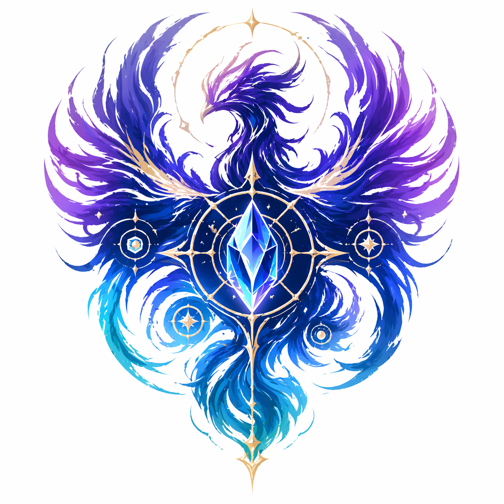

<p align="center"></p>

# Eidolons

> A personal, portable team of AI agents. Each is a named specialist with its own methodology, identity, and boundaries. They work alone when the task is sharp; they work in harmony when the task is big; they travel together, from project to project, codebase to codebase, host to host.

Most AI coding tools ship a single generalist that tries to plan, scout, build, and document all at once — a ceiling that arrives fast. Eidolons is a different shape: six independently-versioned specialists, one CLI, drop into any project. You get sharp boundaries instead of one confused generalist — plan, build, document, debug, and reason with the right specialist for each phase. They travel with you across projects and hosts (Claude Code, Copilot, Cursor, OpenCode, Codex).

<p align="center">
<a href="https://github.com/Rynaro/eidolons/actions/workflows/roster-health.yml"></a>
<a href="https://github.com/Rynaro/eidolons/actions/workflows/ci.yml"></a>
<a href="LICENSE"></a>


</p>

---

## Try it in 60 seconds

Evaluation, not commitment — this drops a read-only ATLAS into a throwaway folder:

```bash
curl -sSL https://raw.githubusercontent.com/Rynaro/eidolons/main/cli/install.sh | bash
cd /tmp && mkdir eidolons-demo && cd eidolons-demo
eidolons init --preset minimal --non-interactive
```

Explore, then `rm -rf /tmp/eidolons-demo` and walk away. For the full install flow, see [Install](#install) below.

---

## Meet the team

| Eidolon | What it does for you | When to reach for it | Repo | Latest |
|---------|---------------------|----------------------|------|--------|
| **ATLAS**<br><sub>A→T→L→A→S</sub> | Maps an unfamiliar codebase without writing a single line. Evidence-anchored findings, read-only by construction. | Auditing a new repo, onboarding, before any change. | [Rynaro/ATLAS](https://github.com/Rynaro/ATLAS) | 1.2.2 |
| **SPECTRA**<br><sub>S→P→E→C→T→R→A</sub> | Turns a scout report or rough idea into a decision-ready spec — scoring rubrics, validation gates, GIVEN/WHEN/THEN stories. | Planning a feature before you build it. | [Rynaro/SPECTRA](https://github.com/Rynaro/SPECTRA) | 4.2.10 |
| **APIVR-Δ**<br><sub>A→P→I→V→Δ/R</sub> | Implements features in brownfield code — pattern-first, test-anchored, bounded failure-recovery loop. | Shipping the change SPECTRA planned. | [Rynaro/APIVR-Delta](https://github.com/Rynaro/APIVR-Delta) | 3.0.5 |
| **IDG**<br><sub>I→D→G</sub> | Synthesizes documentation from sessions, specs, and deltas — provenance-first, with `[GAP]` / `[DISPUTED]` markers. | Chronicling what you (or the team) just built. | [Rynaro/IDG](https://github.com/Rynaro/IDG) | 1.1.5 |
| **FORGE**<br><sub>F→O→R→G→E</sub> | Deliberates on ambiguous trade-offs and novel problems. Names alternatives, surfaces assumptions, returns verdict + confidence. | Two patterns apply and the choice isn't obvious. | [Rynaro/FORGE](https://github.com/Rynaro/FORGE) | 1.2.1 |
| **VIGIL**<br><sub>V→I→G→I→L</sub> | Forensic debugger for failures resistant to normal repair. Reproduction-gated, counterfactual-verified, dependency-graph-ranked. | Flaky test, heisenbug, or a regression you can't explain. | [Rynaro/VIGIL](https://github.com/Rynaro/VIGIL) | 1.0.3 |

Versions and detailed handoff contracts live in [`roster/index.yaml`](roster/index.yaml) — the machine-readable source of truth.

---

## How they compose

The team has a default shape: ATLAS scouts, SPECTRA plans, APIVR-Δ builds, IDG chronicles. FORGE and VIGIL are lateral specialists — consultable at any stage, not always in-line. Partial teams are first-class; bring just ATLAS to an audit, the full pipeline to a greenfield, or any slice that fits your project. See [`methodology/composition.md#partial-team-deployment`](methodology/composition.md#partial-team-deployment) for the full matrix and common configurations.

<details>
<summary>Canonical pipeline</summary>

```
ATLAS ───▶ SPECTRA ───▶ APIVR-Δ ───▶ IDG
  scout      plan         build        chronicle
             ▲              │ ▲
             │              │ │
           FORGE ◀─── (ambiguity, trade-offs, novel problems)
                            │ │
                          VIGIL ◀─── (failure resisted repair; forensic attribution)
```

</details>

Handoffs between members are structured artifacts written to disk — not free-form messages. See [`methodology/composition.md`](methodology/composition.md) for the handoff contract table and invariants.

---

## Install

One-time, global:

```bash
curl -sSL https://raw.githubusercontent.com/Rynaro/eidolons/main/cli/install.sh | bash
```

This installs the `eidolons` CLI to `~/.local/bin/eidolons` and caches the nexus at `~/.eidolons/nexus`.

Per project — works on empty folders or running projects:

```bash
cd <any-project>
eidolons init                    # interactive — choose members and preset
eidolons add forge               # add a single member later
eidolons sync                    # reconcile installed members to eidolons.yaml
eidolons verify                  # re-check installed Eidolons against the roster's signed metadata
```

Commit `eidolons.lock` alongside `eidolons.yaml` — the lockfile pins resolved versions and integrity checksums (`commit`, `tree`, `archive_sha256`, `manifest_sha256`) for reproducible, tamper-evident installs. For the full flow, read [`docs/getting-started.md`](docs/getting-started.md).

---

## Verified releases

Every shipped Eidolon publishes attestation-backed releases through a canonical workflow ([`eidolon-release-template.yml`](.github/workflows/eidolon-release-template.yml)) hosted in this nexus. Each release records its commit, tree, and archive SHA-256 into `roster/index.yaml` via [`Roster Intake`](.github/workflows/roster-intake.yml), with GitHub artifact attestations bound to the canonical signer workflow.

`eidolons sync` and `eidolons verify` enforce that contract on the consumer side. Under the default `integrity.enforcement: strict` posture, any installed Eidolon whose commit/tree/archive checksum drifts from the roster's signed metadata aborts with exit 1 — same gate `Roster Health` runs nightly against every shipped Eidolon. Read the trust model end-to-end at [`docs/release-integrity.md`](docs/release-integrity.md).

---

## What's in this repo

| Area | What it contains |
|------|------------------|
| [`roster/`](roster/) | Machine-readable registry of every Eidolon, their versions, repos, handoff contracts |
| [`methodology/`](methodology/) | Aggregated [design principles](methodology/prime-directives.md), [composition contracts](methodology/composition.md), vocabulary |
| [`research/`](research/) | Papers, citations, production patterns, scientific backing |
| [`cli/`](cli/) | The `eidolons` command-line tool — installs and orchestrates the team |
| [`schemas/`](schemas/) | JSON Schemas for `eidolons.yaml`, `eidolons.lock`, roster entries |
| [`docs/`](docs/) | Getting started, architecture, CLI reference |
| [`examples/`](examples/) | Worked examples: greenfield, brownfield, solo-member, partial-team |

---

## Why a nexus

Each Eidolon is independently installable and independently versioned — that's a hard design invariant. The nexus exists because:

1. **Discovery.** Without a roster, nobody knows which Eidolons exist or how they relate.
2. **Composition.** The team is more than the sum of its members. Handoff contracts, pipeline conventions, and partial-team deployment patterns live here, not in any individual Eidolon's repo.
3. **Research.** The scientific backing for the whole program — papers, production precedents, evidence-to-design mappings — is a shared asset. Duplicating it across five repos is wasteful and drifts.
4. **Installation orchestration.** A single `eidolons add atlas,spectra,apivr` is worth fifty lines of documentation explaining how to clone three repos and run three installers.
5. **Supply-chain integrity.** The release-integrity contract is a *shared* asset: one canonical signing workflow ([`eidolon-release-template.yml`](.github/workflows/eidolon-release-template.yml)) every Eidolon adopts, one ingestion path ([`Roster Intake`](.github/workflows/roster-intake.yml)) that verifies attestations, one consumer-side gate (`eidolons verify`) that enforces them. Six independent repos with six independent signing schemes would defeat the trust model.

Each Eidolon remains a first-class repo. This nexus is a coordinator, not an owner. The four-layer architecture (install standard → Eidolon repos → this nexus → consumer project) is documented in [`docs/architecture.md`](docs/architecture.md).

---

<!-- Curated highlights from CHANGELOG.md "Unreleased". Refresh on every release. -->
## Recently shipped

- **Ecosystem normalized — supply-chain integrity end-to-end.** All six shipped Eidolons (ATLAS, SPECTRA, APIVR-Δ, IDG, FORGE, VIGIL) now publish attestation-backed releases via the canonical [`eidolon-release-template.yml`](.github/workflows/eidolon-release-template.yml). Every `versions.releases.<v>` block in [`roster/index.yaml`](roster/index.yaml) carries `commit`, `tree`, `archive_sha256`, and a GitHub-signed provenance attestation, ingested via [`Roster Intake`](.github/workflows/roster-intake.yml). `integrity.enforcement` is `strict` by default — any consumer install with a checksum mismatch aborts with exit 1. See [`docs/release-integrity.md`](docs/release-integrity.md).
- **ATLAS v1.2.2** — atlas-aci MCP tools now reach the Claude Code subagent (`tools:` allowlist rewrite); MCP config writes absolute project paths instead of `${workspaceFolder}`; new `eidolons atlas aci index` first-class re-index subcommand. See [CHANGELOG.md](CHANGELOG.md).
- **VIGIL v1.0 is shipped** — forensic root-cause attribution for failures resistant to normal repair, with dependency-graph ranking and counterfactual verification. See [Rynaro/VIGIL](https://github.com/Rynaro/VIGIL).
- **`eidolons upgrade` is fully implemented** — `--check` for read-only diffs, applies member upgrades within `eidolons.yaml` SemVer constraints, idempotent on repeat runs. See [CHANGELOG.md](CHANGELOG.md).
- **EIIS bumped to v1.1** with an external standalone conformance checker. See [Rynaro/eidolons-eiis](https://github.com/Rynaro/eidolons-eiis).

---

## Relationship to EIIS

The **Eidolons Individual Install Standard** (`Rynaro/eidolons-eiis`) defines the contract every Eidolon repo satisfies — file layout, `install.sh` interface, manifest schema.

This nexus (`Rynaro/eidolons`) *depends* on EIIS. Every Eidolon listed in [`roster/index.yaml`](roster/index.yaml) must be EIIS-conformant; the CLI refuses to install non-conformant members.

They version independently. EIIS v1.x is the contract; eidolons v1.x is the orchestrator.

---

## Contributing

Per-Eidolon bugs and feature requests belong in that Eidolon's repo (e.g. an ATLAS finding goes to [Rynaro/ATLAS](https://github.com/Rynaro/ATLAS), not here). CLI bugs, roster issues, and composition-contract changes belong in this repo ([Rynaro/eidolons](https://github.com/Rynaro/eidolons)). Questions about the install standard itself belong in [Rynaro/eidolons-eiis](https://github.com/Rynaro/eidolons-eiis). If you're unsure which layer owns a concern, [`docs/architecture.md`](docs/architecture.md) maps the four layers and their responsibilities.

---

## License

Apache-2.0. See [LICENSE](LICENSE).
